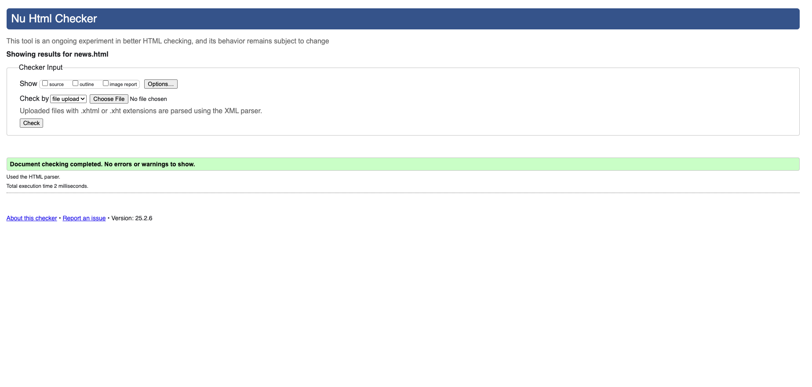

# Tugas Pemweb Genap
- [Tugas 1](./tugas1/Tugas%20Individu%201%20Pemweb%20-%20Adi%20Sulaksono%20120140038.pdf)
- [Tugas 2](./tugas2/)

    .....

## Tugas 1
Membuat sebuah skema cara kerja dari web server dan web browser dalam melakukan request dan response.

## Tugas 2
Membuat web sederhana dengan semantic HTML tanpa CSS dan Javascript. Tervalidasi oleh W3C Validator.

----

_Adi Sulaksono_
120140038